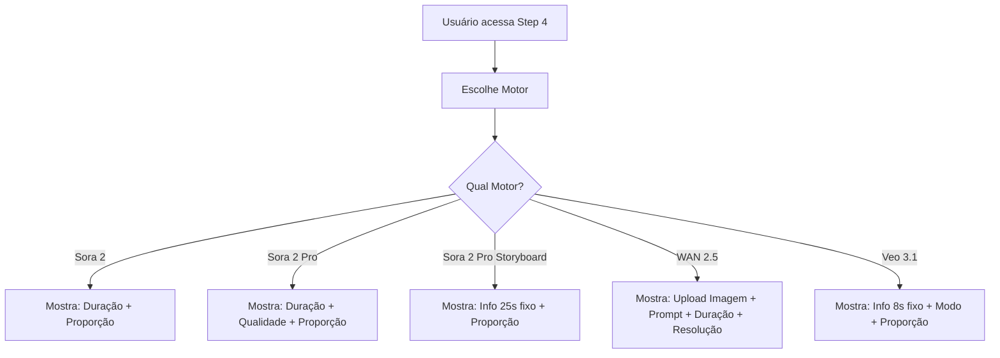

# Arquitetura Motor-First - Seleção de Formato de Vídeo

## Visão Geral

A tela de "Formato do Vídeo" (Step 4) foi completamente refatorada para seguir uma arquitetura motor-first, onde o usuário primeiro escolhe o motor de geração e depois vê apenas as opções compatíveis com aquele motor específico.

## Estrutura

### 1. Componente Principal: VideoEngineSelector

Localização: `/src/components/ui/VideoEngineSelector.jsx`

Este componente gerencia toda a lógica de seleção de motor e renderização condicional de configurações.

### 2. Motores Disponíveis

#### Sora 2
- **Durações**: 10s ou 15s
- **Qualidade**: Standard (fixa)
- **Proporção**: 9:16 ou 16:9
- **Características**: Motor básico para geração rápida

#### Sora 2 Pro
- **Durações**: 10s ou 15s
- **Qualidade**: Standard ou High
- **Proporção**: 9:16 ou 16:9
- **Características**: Motor profissional com opções de qualidade

#### Sora 2 Pro — Storyboard
- **Duração**: 25s (fixa, não editável)
- **Cenas**: 3 cenas automáticas
- **Proporção**: 9:16 ou 16:9
- **Características**: Modo especial para geração de múltiplas cenas em sequência

#### WAN 2.5 (Image → Video)
- **Durações**: 5s ou 10s
- **Resolução**: 720p ou 1080p
- **Campos obrigatórios**:
  - Imagem base (upload)
  - Prompt de movimento (máx 800 caracteres)
- **Campos opcionais**:
  - Negative prompt (máx 500 caracteres)
  - Expansão automática de prompt
- **Nota**: Não mostra proporção (tratada no export)

#### Veo 3.1 (Image → Video)
- **Duração**: 8s (fixa, não editável)
- **Modo**: Fast ou Quality
- **Proporção**: 9:16 ou 16:9
- **Características**: Motor focado em velocidade vs qualidade

## Fluxo de Uso



## Regras de Validação

### Validação Básica (Step 4)
- `engineType` deve estar selecionado

### Validação Específica para WAN 2.5
- `wanImageUrl` deve estar presente (imagem carregada)
- `wanPrompt` deve ter conteúdo (não vazio após trim)

### Outros Motores
- Não requerem validações adicionais além da seleção do motor

## Estado do FormData

### Campos Gerenciados

```javascript
{
  // Motor selecionado (campo principal)
  engineType: 'sora-2' | 'sora-2-pro' | 'sora-2-pro-storyboard' | 'wan-2.5' | 'veo-3.1',

  // Campos legados (mantidos para compatibilidade)
  videoModel: 'veo3' | 'wan-2.5' | 'veo3.1',
  model: 'sora-2' | 'sora-2-pro',

  // Configurações Sora
  quality: 'standard' | 'high',
  aspectRatio: '9:16' | '16:9',
  duration: '10s' | '15s' | '25s' | '8s',
  storyboardMode: boolean,

  // Configurações WAN 2.5
  wanImageUrl: string | null,
  wanPrompt: string,
  wanDuration: 5 | 10,
  wanResolution: '720p' | '1080p',
  wanNegativePrompt: string,
  wanEnablePromptExpansion: boolean,

  // Configurações Veo 3.1
  veoMode: 'fast' | 'quality'
}
```

## Vantagens da Nova Arquitetura

### 1. Impossível Criar Combinações Inválidas
- Cada motor só mostra suas próprias opções
- Valores incompatíveis são automaticamente definidos ao trocar de motor

### 2. UX Simplificada
- Menos confusão sobre quais opções estão disponíveis
- Interface progressiva (escolha motor → vê opções)
- Feedback visual claro sobre o que está selecionado

### 3. Escalabilidade
- Adicionar novos motores é simples: criar novo card + componente de configuração
- Não há risco de conflitos entre motores diferentes
- Cada motor é independente e autocontido

### 4. Compatível com KIE API
- Estrutura alinhada com os endpoints reais da API
- Validações garantem que apenas dados válidos sejam enviados
- Mapeamento direto entre UI e payload da API

## Componentes Internos

### SoraSettings
- Renderiza configurações para Sora 2
- Duração + Proporção

### SoraProSettings
- Renderiza configurações para Sora 2 Pro
- Duração + Qualidade + Proporção

### SoraProStoryboardSettings
- Renderiza configurações para Sora 2 Pro Storyboard
- Info box sobre 25s fixo + Proporção

### WanSettings
- Renderiza configurações para WAN 2.5
- Upload de imagem + Prompt + Duração + Resolução + Negative Prompt

### VeoSettings
- Renderiza configurações para Veo 3.1
- Info box sobre 8s fixo + Modo + Proporção

### AspectRatioSelector
- Componente reutilizável para seleção de proporção
- Usado por Sora 2, Sora 2 Pro, Sora 2 Pro Storyboard e Veo 3.1

## Manutenção

### Adicionar Novo Motor

1. **Adicionar ao enum ENGINE_TYPES**
```javascript
const ENGINE_TYPES = {
  // ... existentes
  NEW_ENGINE: 'new-engine'
};
```

2. **Adicionar ao array ENGINES**
```javascript
{
  id: ENGINE_TYPES.NEW_ENGINE,
  name: 'Novo Motor',
  description: 'Descrição curta',
  subtitle: 'Detalhes adicionais'
}
```

3. **Criar handler no handleEngineSelect**
```javascript
case ENGINE_TYPES.NEW_ENGINE:
  updateFormData('engineType', engineId);
  // Configurar outros campos necessários
  break;
```

4. **Criar componente de configuração**
```javascript
function NewEngineSettings({ formData, updateFormData }) {
  return (
    <div className="space-y-6 fade-in">
      {/* Suas configurações aqui */}
    </div>
  );
}
```

5. **Adicionar renderização condicional**
```javascript
{selectedEngine === ENGINE_TYPES.NEW_ENGINE && (
  <NewEngineSettings
    formData={formData}
    updateFormData={updateFormData}
  />
)}
```

6. **Atualizar validação em SoraManual.jsx**
```javascript
case 4:
  if (!formData.engineType) return false;
  if (formData.engineType === 'new-engine') {
    return /* suas validações */;
  }
  return true;
```

## Troubleshooting

### Motor não está salvando a seleção
- Verificar se `engineType` está sendo atualizado no formData
- Confirmar que `updateFormData` está sendo chamado corretamente

### Opções de um motor aparecem para outro
- Verificar condicionais de renderização
- Garantir que `selectedEngine === ENGINE_TYPES.X` está correto

### Validação não está funcionando
- Conferir implementação em `validateStep()` no SoraManual.jsx
- Verificar se o case 4 está tratando o engineType corretamente

### Campos não estão sendo resetados ao trocar motor
- Adicionar lógica no `handleEngineSelect` para resetar campos conflitantes
- Garantir que cada motor define todos os seus campos obrigatórios
